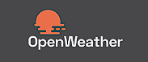

# Weather Balloon 

# PWA Weather App

Welcome to the PWA Weather App, a progressive web application built with NextJS. This application is designed to provide you with the most accurate and timely weather forecasts at your fingertips.

## Features

- **Current Weather Information**: The app provides real-time weather information for your current location, keeping you updated with the latest weather conditions.

- **Forecast**: Stay ahead of the weather with our forecast feature. The app provides weather forecasts for the coming days, helping you plan your activities in advance.

- **Dark Mode and Light Mode**: With both Dark and Light modes available, you can choose the theme that best suits your preference or time of day. The Dark mode is perfect for low-light environments to reduce eye strain, while the Light mode is ideal for brighter environments.

- **Progressive Web App (PWA)**: As a PWA, this app can be installed on your device and offers a seamless, app-like user experience. It's fast, reliable, and engaging.

- **Built with NextJS**: This application is built using NextJS, a powerful and flexible framework for building user-friendly applications.

Stay informed and plan your days better with the PWA Weather App. Enjoy the most accurate and timely weather forecasts right at your fingertips.

## Languages and Technologies Used:

    </img>

## API From:

    

## Deployed On:

